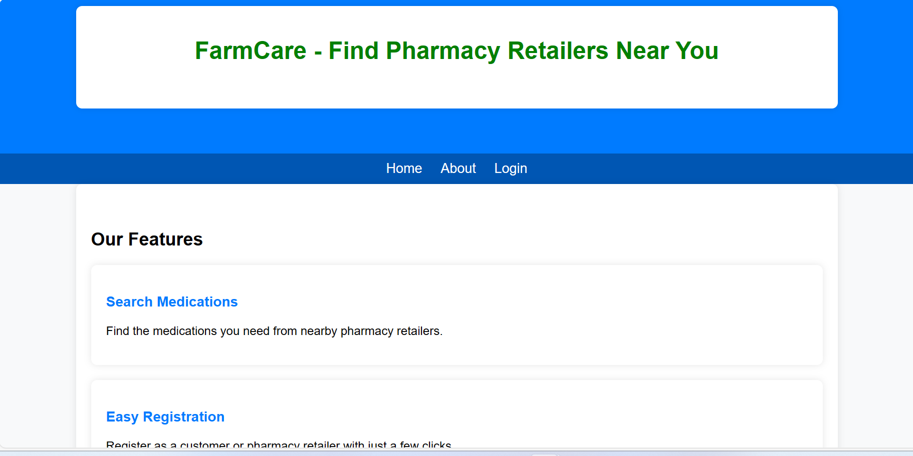

### FarmCare
#### Introduction
FarmCare is a web application designed to streamline pharmacy inventory management and customer profiles. It offers features for pharmacies to manage their medication inventory and for customers to create profiles, search for medications, and find pharmacies that carry specific medications.

## Inspiration
The idea for FarmCare stemmed from personal experiences witnessing the complexities of medication management, including tracking multiple prescriptions, managing refills, and coordinating with pharmacies. Recognizing the potential for technology to simplify these processes and improve medication adherence, we embarked on the journey to create FarmCare.

## Technology & Architecture
FarmCare is built using the Flask framework for the backend, with SQLAlchemy for database management and Flask-Marshmallow for serialization. The frontend is developed using HTML, CSS, and JavaScript, with Jinja2 templates for rendering dynamic content. The application follows a client-server architecture, with the backend handling data processing and the frontend providing an intuitive user interface.

## Core Algorithms and Code Snippet
One of the core algorithms in FarmCare is the medication search functionality, which allows users to find medications based on various criteria such as name, dosage, and availability. Below is a code snippet illustrating the implementation of this algorithm:

#### Features

- View a list of medications
- Add new medications
- View a list of pharmacies
- Add new pharmacies

#### Deployment
- **Deployed Site:** [FarmCare](https://selo.pythonanywhere.com/)
- **Final Project Blog Article:** [Portfolio Project Blog post FarmCare](https://medium.com/@Selomon1/d1d324c38668)
- **Author's LinkedIn:** [Selomon Teshome](https://www.linkedin.com/in/selomon-teshome-14957218b)

#### Installation
To run FarmCare locally, follow these steps:
1. Clone the repository: `git clone https://github.com/Selomon1/FarmCare.git`
2. Navigate to the project directory: `cd FarmCare`
3. Install dependencies: `pip install -r requirements.txt`
4. Set up the database: `flask db upgrade`
5. Run the application: `flask run`
6. Access the application in your web browser at `http://localhost:5000`

#### Usage
Once the application is running, pharmacies can register, manage their profiles, add medications, and view their inventory. Customers can register, search for medications, and find pharmacies that carry specific medications.

#### Contributing
Contributions to FarmCare are welcome! If you would like to contribute, please follow these steps:
1. Fork the repository.
2. Create a new branch for your feature or bug fix: `git checkout -b feature/your-feature-name`
3. Commit your changes: `git commit -m "Add your commit message here"`
4. Push to the branch: `git push origin feature/your-feature-name`
5. Submit a pull request.

#### Licensing
This project is licensed under the [MIT License](./LICENSE). See the LICENSE file for details.

---

Thank you for considering FarmCare! If you have any questions or feedback, please don't hesitate to contact us.
